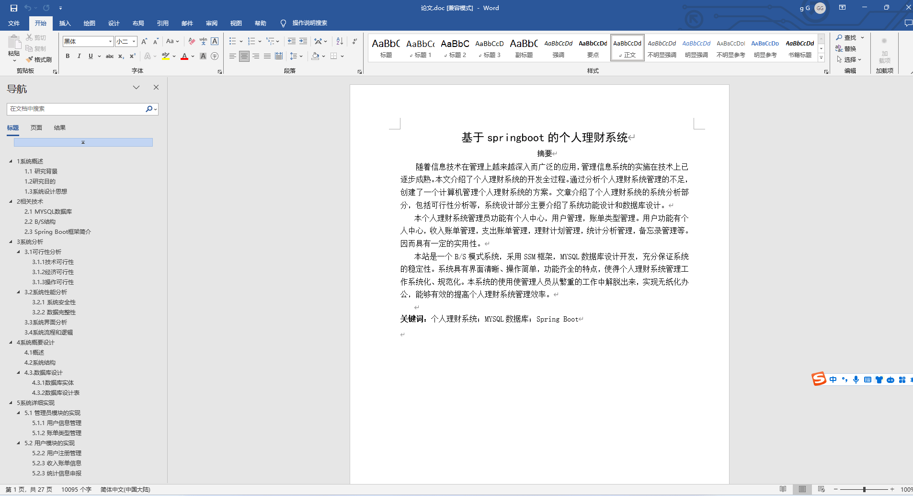
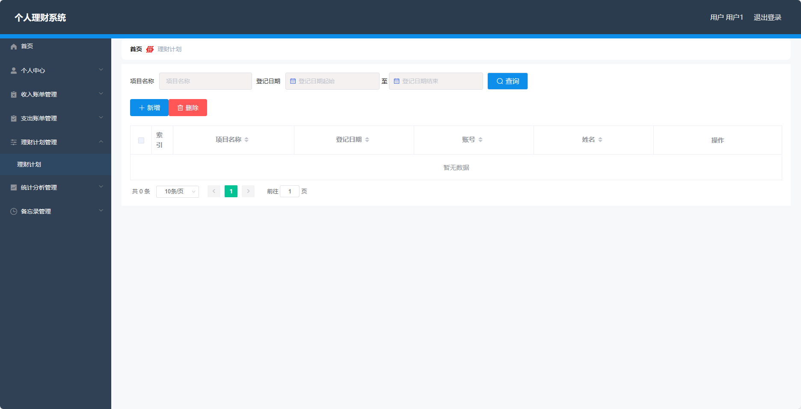
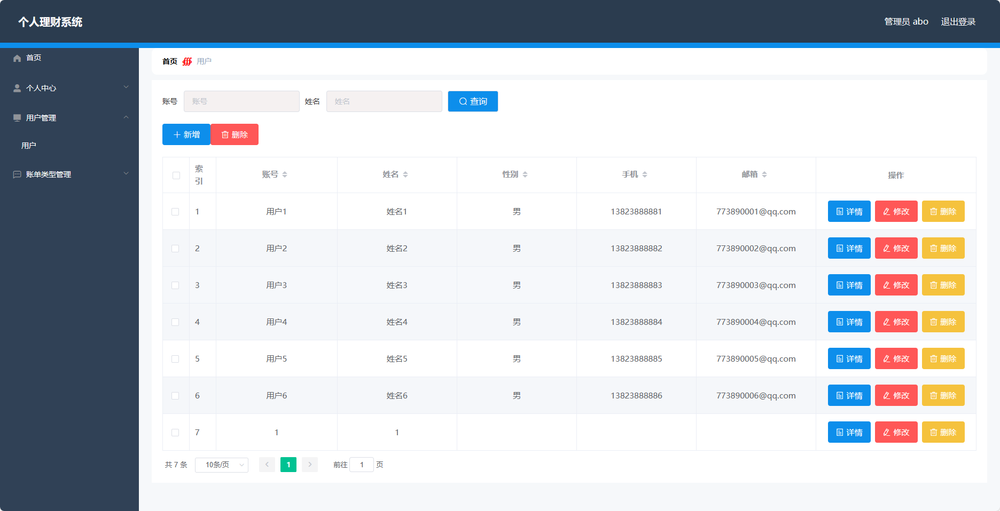
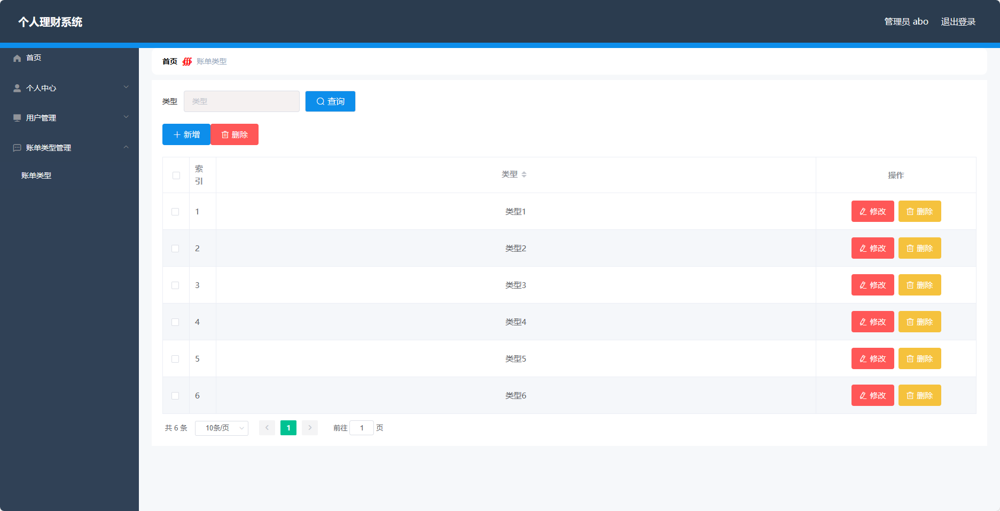

## 基于SpringBoot的个人理财系统(程序+报告)

###  获取sql数据库文件: 从戎源码网 (https://armycodes.com/) QQ: 386869957 QQ群: 377586148
###  所有系统地址: (https://github.com/YuLin-Coder/AllProjectCatalog) 
###  所有项目以及源代码本人均调试运行无问题 可支持远程安装部署调试、定制修改、代码讲解

## 项目介绍
基于SpringBoot的个人理财系统，系统包含两种角色：管理员、用户,系统分为前台和后台两大模块，主要功能如下。

### 【管理员】:
个人中心：管理员可以在个人中心查看和修改自己的个人信息。
用户管理：管理员可以对用户进行管理，包括添加新用户、编辑用户信息、删除用户以及查看用户列表。
账单类型管理：管理员可以管理账单类型，包括添加新的账单类型、编辑账单类型信息、删除账单类型以及查看账单类型列表。

### 【用户】:
个人中心：用户可以在个人中心查看和修改自己的个人信息。
收入账单管理：用户可以添加和管理收入账单，包括记录收入的金额、时间、来源等信息，查看、编辑和删除已记录的收入账单。
支出账单管理：用户可以添加和管理支出账单，包括记录支出的金额、时间、用途等信息，查看、编辑和删除已记录的支出账单。
理财计划管理：用户可以制定和管理理财计划，包括设定目标、计划时间、计划金额等信息，查看、编辑和删除已设定的理财计划。
统计分析管理：用户可以查看自己的收入和支出情况的统计分析结果。
备忘录管理：用户可以添加、编辑和删除备忘录。

## 项目技术
- 编程语言：Java
- 数据库：MySQL
- 项目管理工具：Maven
- 前端技术：HTML、CSS、JavaScript、Jquery、Vue
- 后端技术：Spring、SpringMVC、MyBatis

## 运行环境
- JDK版本：JDK1.8及以上
- 开发工具：IDEA、Ecplise、Myecplise都可以
- 数据库: MySQL5.7及以上
- Maven：maven3.0及以上
- Node：14.14.0及以上

## 运行截图

